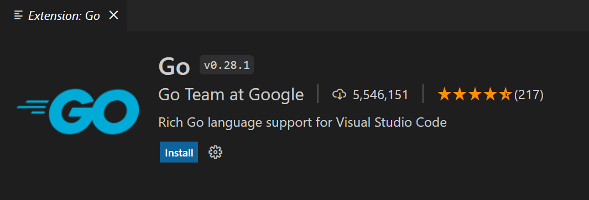
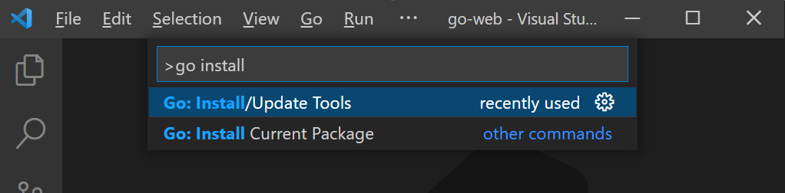
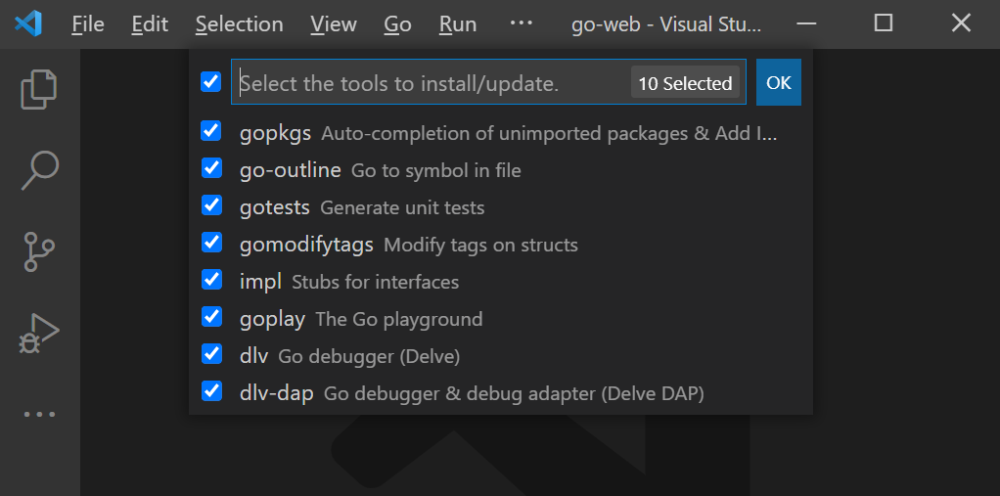
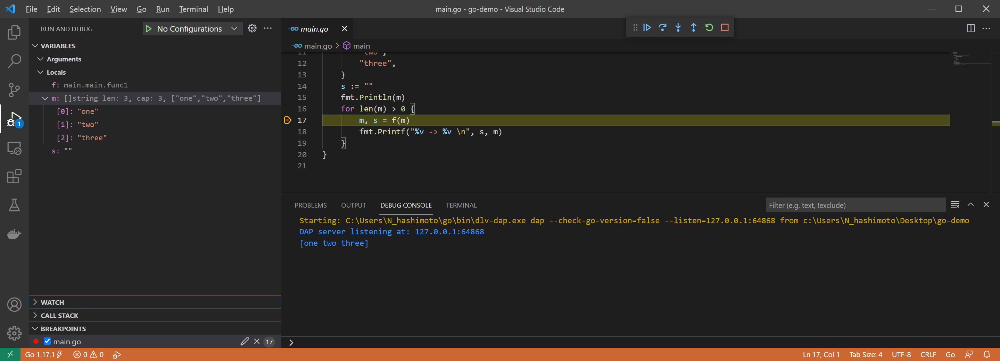
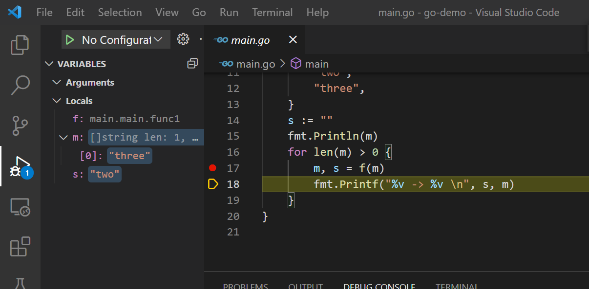

# Go + VSCode(Windows 10) の開発環境（デバッグができるまで）

VSCode でデバッグができるように Go の開発環境を作っていく

## Scoop で Go をインストール

Scoop を使って、次のコマンドで Go をインストールする

``` console
scoop install go
```

## Go 環境変数を確認

次のコマンドを実行すると、Go の環境変数一覧が表示される

``` console
go env
```

この中でも `GOROOT` と `GOPATH` が次の値になっていることを確認する

``` txt
set GOPATH=C:\Users\<ユーザ名>\go
set GOROOT=C:\Users\<ユーザ名>\scoop\apps\go\current
```

## Go 環境変数の変更

上記のように環境変数が設定されていなければ、次のようなコマンドで環境変数を変更する

``` console
go env -w GOPATH=C:\Users\<ユーザ名>\go
```

## 拡張機能をインストール

[golang.Go](https://marketplace.visualstudio.com/items?itemName=golang.Go) 拡張機能を VSCode にインストールする



## GO: Install/Update Tools コマンド

VSCode に必要な Go のパッケージをまとめてインストールしていく

コマンドパレットを開き（ `Ctrl` + `Shift` + `p` ）、「GO: Install/Update Tools」 を選択する



表示されている 10 個のパッケージすべてにチェックを入れて「OK」ボタンを押す



インストールが成功すれば、OUTPUT コンソールに以下のログが表示される。

``` txt
Tools environment: GOPATH=C:\Users\<ユーザ名>\go
Installing 10 tools at C:\Users\<ユーザ名>\go\bin in module mode.
  gopkgs
  go-outline
  gotests
  gomodifytags
  impl
  goplay
  dlv
  dlv-dap
  golangci-lint
  gopls

Installing github.com/uudashr/gopkgs/v2/cmd/gopkgs (C:\Users\<ユーザ名>\go\bin\gopkgs.exe) SUCCEEDED
Installing github.com/ramya-rao-a/go-outline (C:\Users\<ユーザ名>\go\bin\go-outline.exe) SUCCEEDED
Installing github.com/cweill/gotests/gotests (C:\Users\<ユーザ名>\go\bin\gotests.exe) SUCCEEDED
Installing github.com/fatih/gomodifytags (C:\Users\<ユーザ名>\go\bin\gomodifytags.exe) SUCCEEDED
Installing github.com/josharian/impl (C:\Users\<ユーザ名>\go\bin\impl.exe) SUCCEEDED
Installing github.com/haya14busa/goplay/cmd/goplay (C:\Users\<ユーザ名>\go\bin\goplay.exe) SUCCEEDED
Installing github.com/go-delve/delve/cmd/dlv (C:\Users\<ユーザ名>\go\bin\dlv.exe) SUCCEEDED
Installing github.com/go-delve/delve/cmd/dlv@master (C:\Users\<ユーザ名>\go\bin\dlv-dap.exe) SUCCEEDED
Installing github.com/golangci/golangci-lint/cmd/golangci-lint (C:\Users\<ユーザ名>\go\bin\golangci-lint.exe) SUCCEEDED
Installing golang.org/x/tools/gopls (C:\Users\<ユーザ名>\go\bin\gopls.exe) SUCCEEDED

All tools successfully installed. You are ready to Go :).
```

## 動作確認用のコード

go-demo ディレクトリを作成し、以下の内容の main.go ファイルを作成する

``` golang
package main

import "fmt"

func main() {
	f := func(a []string) ([]string, string) {
		return a[1:], a[0]
	}
	m := []string{
		"one",
		"two",
		"three",
	}
	s := ""
	fmt.Println(m)
	for len(m) > 0 {
		m, s = f(m)
		fmt.Printf("%v -> %v \n", s, m)
	}
}
```

## デバッグの動作確認

実行を止めたい箇所にブレークポイントを張り（赤丸）、F5 を押してデバッグを開始する



F10 を押すと実行箇所が進むので、エディタ左側のデバッグペインに表示される変数が処理によって変化していくことを確認する



デバッグの動作確認は以上です

## Go Modules の確認

Go Modules が使えるようにしていく

Go 環境変数に設定してある GO111MODULE の値を `go env GO111MODULE` コマンドで確認する

``` console
go env GO111MODULE
off
```

上記のようになれば、`set GO111MODULE=off` となっているので、設定値を次のコマンドで削除する

``` console
go env -w GO111MODULE=
```

## go.mod ファイルの作成

次のコマンドで go.mod ファイルを作成する

``` console
go mod init example.com/hoge/hello
```

作成された go.mod ファイルの中身は次のようになる

``` golang
module example.com/hoge/hello

go 1.17
```

